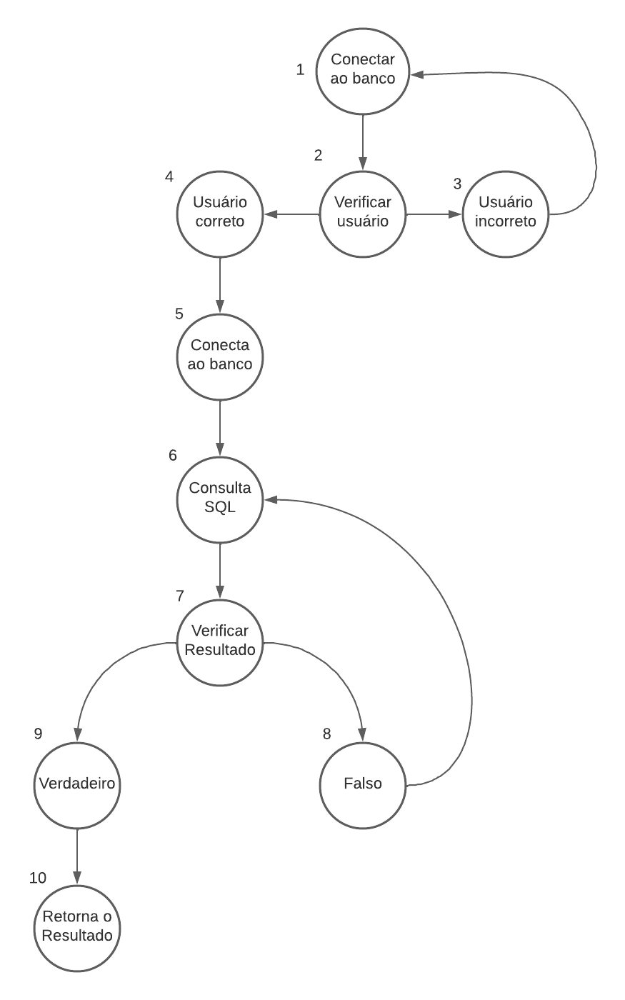

# Exercício individual - Teste de Caixa Branca (ETAPA 1)

## Erros encontrados

### 1. Variável sendo utilizada com o nome errado na linha 14 em `User.java`

````java
public Connection conectarDB() {
    Connection connection = null;
    try {
        Class.forName("com.mysql.Driver.Manager").newInstance();
        String url = "jdbc:mysql://127.0.0.1/test?user=lopes&password=123";
        conn = DriverManager.getConnection(url);
        // ^ deveria ser 'connection' da mesma forma como foi declarada
    } catch (Exception e) {
    }
    return connection;
};
````

### 2. Difícil leitura no seguinte trecho de código

A forma como a String foi concatenada dificulda a leitura e compreensão do código.

````java
// [...]

String sql = "";
Connection conn = conectarDB();

sql += "select nome from usuarios ";
sql += "where login = " + "'" + login + "'";
sql += " and senha = " + "'" + senha + "'";

// [...]
````

Sugestão de melhoria:

````java
// [...]

Connection conn = conectarDB();
String sql = "select nome from usuarios where login = '" + login + "' and senha = '" + senha + "'";

// [...]
````

### 3. Varíavel não declarada na linha 33 em `User.java`

Apenas o tipo da variável foi declarado em `ResultSet = st.executeQuery(sql);`. Dessa forma, surgem dois erros de variável não declarada nas linhas abaixo

````java
//[...]

try {
    Statement st = conn.createStatement();
    ResultSet = st.executeQuery(sql); // Local onde deveria ser declarada a variável
    
    if (rs.next()) { // Variável não declarada 
        result = true;
        nome = rs.getString("nome"); // Variável não declarada
    }
} catch (Exception e) {
}

//[...]
````

Para resolver os erros apontados poderíamos reescrever o trecho da seguinte forma:

````java
//[...]

try {
    Statement st = conn.createStatement();
    ResultSet rs = st.executeQuery(sql); // Declarando a variável rs do tipo ResultSet
    
    if (rs.next()) {
        result = true;
        nome = rs.getString("nome");
    }
} catch (Exception e) {
}

//[...]
````

### 4. Não há tratamento de exceções nos blocos try-catch

Não há o tratamento de exceções nos blocos try-catch. Dessa forma, caso o ocorra um erro durante a execução do código, não haverá um tratamento adequado

````java
// [...]
public Connection conectarDB() {
    Connection connection = null;
    try {
        Class.forName("com.mysql.Driver.Manager").newInstance();
        String url = "jdbc:mysql://127.0.0.1/test?user=lopes&password=123";
        conn = DriverManager.getConnection(url);
        
    } catch (Exception e) {
    }
    return connection;
};
// [...]
````

### 5. Método depreciado

O método newInstance() está depreciado: _"The method newInstance() from the type Class<capture#1-of ?> is deprecatedJava(67108967)"_

````java
// [...]
Class.forName("com.mysql.Driver.Manager").newInstance();
// [...]
````

Correção:

````java
// [...]
Class.forName("com.mysql.Driver.Manager").newInstance();
// [...]
````

### 6. Sugestão

````java
package com.example;

import java.sql.Connection;
import java.sql.DriverManager;
import java.sql.Statement;
import java.sql.ResultSet;

public class User {
    public Connection connection;
    public String nome = "";
    public boolean result = false;

    public void conectarDB() throws Exception {
        try {
            Class.forName("com.mysql.Driver.Manager");
            String url = "jdbc:mysql://127.0.0.1/test?user=lopes&password=123";
            this.connection = DriverManager.getConnection(url); // 2
        } catch (Exception e) {
            throw e;
        }
    }

    public boolean verificarUsuario(String login, String senha) throws Exception {
        try {
            this.conectarDB(); // 1
        } catch (Exception e) {
            System.out.println("Erro ao conectar no banco de dados"); //3
        }

        // 4
        // 5
        
        String query = "select nome from usuarios where login = '" + login + "' and senha = '" + senha + "'";

        try {
            Statement statement = this.connection.createStatement(); //6
            ResultSet resultSet = statement.executeQuery(query);

            if (resultSet.next()) { // 7
                this.result = true;
                this.nome = resultSet.getString("nome");
            }
        } catch (Exception e) {
            throw e; // 8
        }
        return result; // 10
    }
}
````

## Etapa 2

### Grafo



### Cálculo da Complexidade Ciclomático

V(G) = 2 REGIÕES.
V(G) = 11 ARESTAS.
V(G) = 10 NÓS.
CÁLCULO: V(G) = (ARESTAS – NÓS) + 2 = 4

Cálculo: V(G) = (11 - 10) + 2 = 3

### Sequências

* 1;2;3;
* 1;2;4;5;6;7;8;6;
* 1;2;4;5;6;7;8;9;10;
